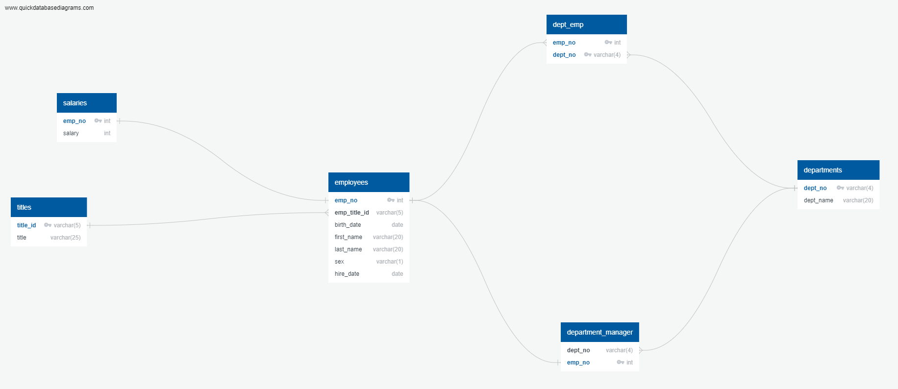
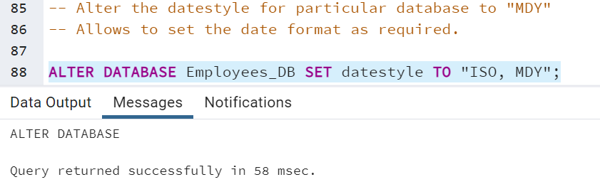
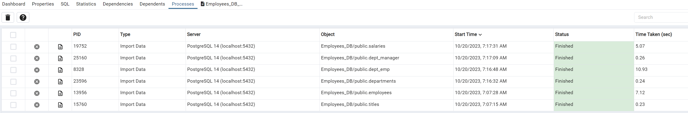
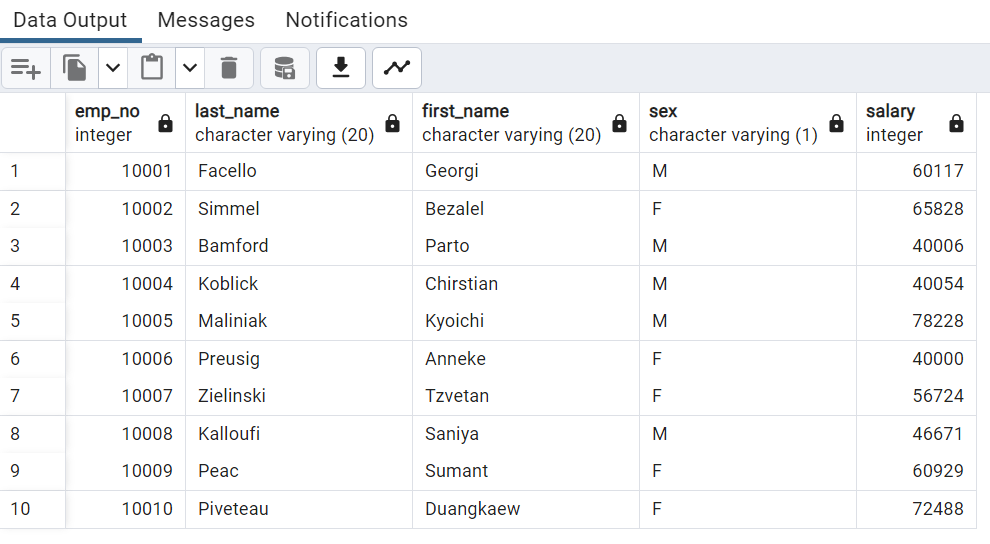
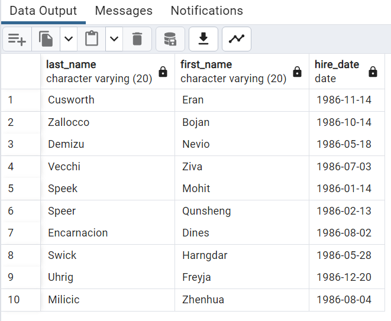
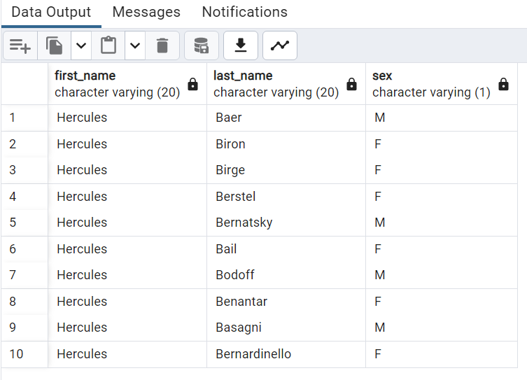
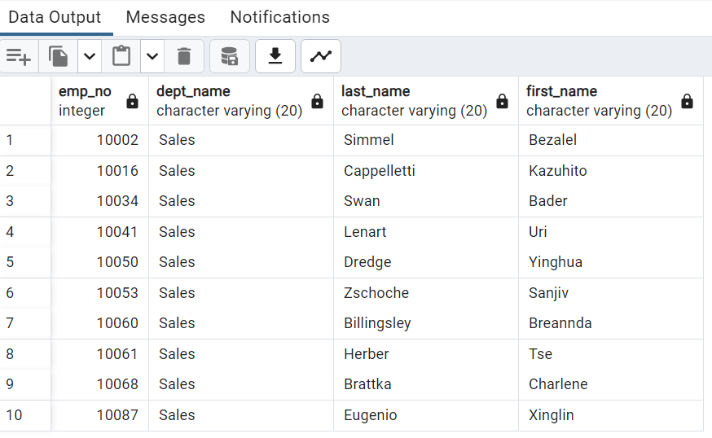
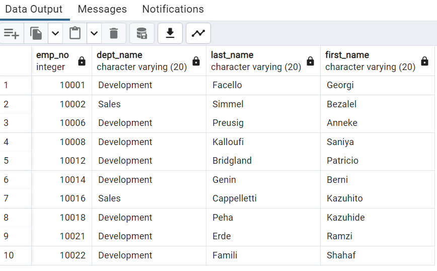

## SQL Challenge- Pewlett Hackard

## 1 Project Overview 

- The project is for a fictional company named Pewlett Hackard which has hired me as their new data engineer. The main task assigned to me is to do a research project on the employees the company hired during the 1980s and 1990s in my current capacity. The only resources at hand in order to accompalish the task are six CSV files from the employye database including employees_CSV, dept_managers_CSV, salaries_CSV and so on.I will be making use of my knowledge and expertise of SQL tools to analysis the available data. We have broken down the task into three parts: 1) data modelling, 2) data engineering & 3) data analysis.

- In this SQL challenge, we explore and analyze employee data using a relational database. The challenge consists of several SQL queries that aims to provide insights into employee information, department management, hiring trends, and more.

## 2 Data Sources

As described in the brief overview of my project, the data I will be using is provided by the company Pewlett-Hackard. These are six CSV files related to multiple employee attributes(employee number, department, titles, salaries etc.) fetched from the employee database from the year 1980s and 1990s.

## 3 Project Structure

- If we talk about the project structure, we have the following files/folders as given below

- First we have our resources folder named "Starter_code" in which is enclosed a "data" folder  conatining all the six CSV files that we will be using.

- Then we have a "sql-challenge" folder which contains a "README.md" file and a folder called "EmployeeSQL"

- The "EmployeeSQL" folder further conatins the major files of our project namely the Employee_schema.sql,Employees_Table_PK_FK.sql, 
Employee_db_ERD_diagram.png & Data_Analysis_Queries.sql

## 4 Database Schema/Data Modelling
- As the first stepping stone to my project I inspected all the CSV files thoroughly and then created an Entity Relationship Diagram from the tables. To do so I made use of an efficient online datadebase diagram drawing tool called  the "QuickDBD" using the employee schema. The file for the said code is attached.

- I tried to assign the datatype, primary keys, foreign keys and other constraints for the tables simultaneously creating relationships amongst entities such as (one-to-one -, many-to-one >- etc.) wherever applicable to the best of my knowledge.Once everything was in place with regard to the schema, the QuickDBD generated an Entity Relationship Diagram as shown below:

## 5 Data Engineering
For these files I needed to set the datestyle in the "Employees_DB" database which corresponds to the same in CSV files.

I then moved on to import each CSV file into its corresponding SQL table. For this I used the PgAdmin 4. I was able to successfully load all the CSV files there. - .Below are a few screenshots of the import processes confirming the same.

## 6 Data Analysis

After all the CSV files were correctly imported, I proceeded to write queries with regard to multiple aspects such as employee salary, hiring trend, managerial structure, department assignment, employee search, department-specific analysis, multiple-department analysis (Sales and Development) as part of the data analysis as required.

## 7 Analysis Output
       
Our observation of data analysis depicts the information as required for each query (with first 10 rows).

# 7.1 Salary Analysis

This output shows a list of employee information along with each employees salary. We may be able to deduce from here that the salaries of employees differ probably based on multiple factors including their specific role, expertise, experience they carry and their overall performance.

# 7.2 Hiring Trends

The current query generates a list of employees hired in 1986 only. This can uncover the hiring trend for the year. In our case 1000 employees were being hired overall by the company in the year 1986.Analyzing hiring trends over time may help identify patterns in workforce expansion or changes in the organization's recruitment strategies.

# 7.3 Managerial Structure

This query returns a list of department managers and their corresponding departments. This might be of great use as it will clarify who leads which department and one can hence better understand the chain of command.

# 7.4 Department Assignments

The fourth query provides information about which employees belong to which departments. This data can be of immense value for keeping a track of employee roles, responsibilities, and department-specific analysis.

# 7.5 Employee Search

The fifth query allows us to look for specific employees based on their first name and the initial letter of their last name. This can be useful for finding individuals with specific characteristics, which might prove useful for HR or administrative purposes.

# 7.6 Department-Specific Analysis

The sixth query takes into account the Sales department only, providing an insight as to how many employees are working within that specific department. We can assess the size and composition of the Sales department through this result.

# 7.7 Sales & Developement Department Analysis

The seventh query lets us analyze employees across both the Sales and Development departments. This may enable us to draw comparisons between the two departments as well as help us look into shared roles or responsibilities between these departments.

# 7.8 Last Name Frequency

The last query highlights the frequency of last names among employees. A high frequency of a particular last name may suggest common surnames among employees, while lower frequencies indicate diversity.

## 8 Conclusions

In this challenge, we've extracted some valuable key insights making use of the available employee data. These insights help us understand the workforce and organizational dynamics in a better way and make more informed decisions for the company with regard to these areas in future.

